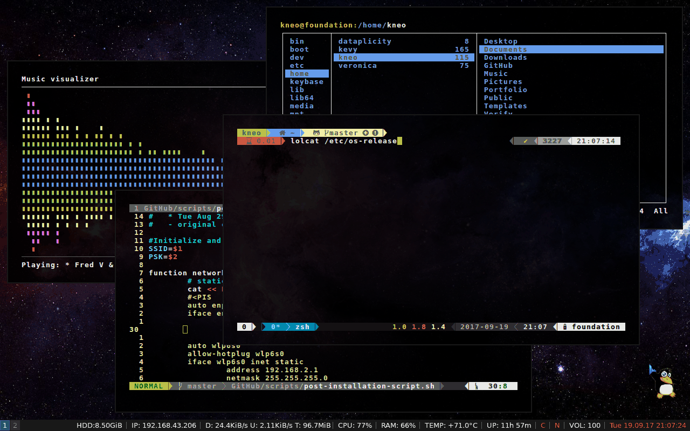

### About Me

Here is my Linux machine. I use Ubuntu 16.04 LTS minimal install. i3-gap is the window manager I used here and some command line interface applications which I would more comfortable with. Last but certainly not least, rxvt-unicode -- my most preferred terminal of all time -- is the one you could see all around here.
&nbsp;

